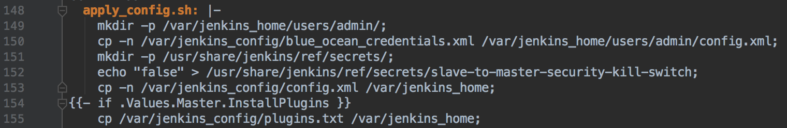

# jenkins-blue-ocean-kubernetes
Quickly provision jenkins blue ocean on kubernetes bare metal with persistent configuration.
Go from a simple 16.04 VM to a portable, scalable declarative CI-CD pipeline with SSL and automatic building on push to github in 10 minutes. 
The Jenkins instance can be deleted and moved between clouds while retaining the job configuration.

The example shown will use a single Hetzner server, but this first step can skipped, and ssh access to an ubuntu 16.04 machine can be used instead.

The sample CI-CD pipeline will uses Lachlan Evanson's excellent croc-hunter tutorial, which I would encourage you to go through after this.
https://github.com/lachie83/croc-hunter

# Checkout repository
```bash
git clone https://github.com/EamonKeane/jenkins-blue-ocean-kubernetes.git
cd jenkins-blue-ocean-kubernetes
```

# Setup with Hetzner Cloud

1. Register on Hetzner (https://www.hetzner.com/cloud)
2. Get API token from dashboard
3. Install hcloud cli: brew install hetznercloud/tap/hcloud (https://github.com/hetznercloud/cli)
4. ```hcloud ssh-key create --name $KEY_NAME --public-key-from-file ~/.ssh/id_rsa.pub```
5. ```hcloud context create jenkins-blue-ocean```. Enter token when prompted
6. Note your ssh-key ID returned from: ```hcloud ssh-key list```

```bash
SERVER_NAME=jenkins-blue-ocean # replace this with your preferred name
SSH_KEY=7170 #replace with your ssh-key id here
SERVER_TYPE=cx41 # Machine with 16GB of ram, 4 vCPU (25 euro per month)
```
To install a single node kubeadm on hetzner run (this will take around 4 minutes):
```bash
./kubernetes-hetzner.sh --SERVER_NAME=$SERVER_NAME --ssh-key=$SSH_KEY --SERVER_TYPE=$SERVER_TYPE
```
Set the jenkins ip variable:
```bash
JENKINS_IP=$(hcloud server list | grep -E $SERVER_NAME | grep -oE "\b([0-9]{1,3}\.){3}[0-9]{1,3}\b");echo $JENKINS_IP
```
# With ssh access to an ubuntu 16.04 machine
```bash
SSH_USER=root
JENKINS_IP=00.00.00.00 #Enter your machine IP here
```
To install a single node kubeadm run (this will take around 4 minutes):
```bash
./kubernetes-ubuntu1604.sh --SSH_USER=$SSH_USER --JENKINS_IP=$JENKINS_IP
```

# Create DNS A-record
* Create a DNS A-record with the IP address of $JENKINS_IP
```bash
JENKINS_URL=jenkins.mysite.io # replace with your jenkins url
```
* Create a DNS A-record with the IP address for croc-hunter:
```bash
CROC_HUNTER_URL=croc-hunter.mysite.io # replace with your jenkins url
```
* Confirm that the $JENKINS_IP record exists at $JENKINS_URL (this may take a minute or two depending on your DNS provider)
```bash
watch -n 5 dig $JENKINS_URL
```

* Confirm that the $CROC_HUNTER_URL record exists at $JENKINS_URL (this may take a minute or two depending on your DNS provider)
```bash
watch -n 5 dig $CROC_HUNTER_URL
```


# Fork the croc-hunter repo from Lachlan Evanson
This contains a lot of best practice and contains a Jenkinsfile which is required to demonstrate Blue Ocean functionality. Alternatively specify your own project which has a Jenkinsfile.
```https://github.com/lachie83/croc-hunter/```
* Make a private image repository (e.g. on Quay.io or Docker Hub) and change the deployment value in the croc-hunter helm chart
```bash
cd ..
git clone https://github.com/EamonKeane/croc-hunter.git
cd croc-hunter
sed -i '' "s/croc-hunter\.squareroute\.io/$CROC_HUNTER_URL/g" Jenkinsfile.json
IMAGE_REPOSITORY=quay.io/eamonkeane/croc-hunter
sed -i '' "s#quay\.io/eamonkeane/croc-hunter#$IMAGE_REPOSITORY#g" charts/croc-hunter/values.yaml
```

# Install jenkins to configure jobs and retrieve secrets
Prerequisites:
* ```brew install kubectl```
* ```brew install helm```
* ```brew install jq```

# Export the kubectl config copied from the kubeadm machine:
```bash
cd ..
cd jenkins-blue-ocean-kubernetes
export KUBECONFIG=admin.conf
```

# Create kubernetes image pull secret for croc-hunter
```bash
DOCKER_SERVER=quay.io
DOCKER_USERNAME=eamonkeane+crochunter
DOCKER_PASSWORD=
DOCKER_EMAIL=.
kubectl create secret docker-registry croc-hunter-secrets --namespace=croc-hunter --docker-server=$DOCKER_SERVER --docker-username=$DOCKER_USERNAME --docker-password=$DOCKER_PASSWORD --docker-email=$DOCKER_EMAIL
```

# Jenkins Installation and Configuration
Replace your jenkins url in the hostname, TLS secret name, and TLS secret section of jenkins-values-initial.yaml and jenkins-values.yaml:
```bash
sed -i '' "s/jenkins\.mysite\.io/$JENKINS_URL/g" jenkins-values.yaml
sed -i '' "s/jenkins\.mysite\.io/$JENKINS_URL/g" jenkins-values-initial.yaml
```

Initial temporary installation of jenkins. This takes approx 4 minutes. This also installs nginx-ingress (configured for bare metal) and cert-manager (configured to auto-provision SSL certs) :
```bash
./jenkins-initial-install.sh 
```

* Go to Jenkins url at: 
```bash
echo https://$JENKINS_URL
```
* Print out jenkins password:
```bash
printf $(kubectl get secret --namespace jenkins jenkins-jenkins -o jsonpath="{.data.jenkins-admin-password}" | base64 --decode);echo
```
* Enter username ```admin``` and password from terminal

* Add docker credentials to jenkins:
1. Click on Credentials
2. Click on Jenkins link
3. Click on Global Credentials
4. Click add credentials
5. Select Username  and password
6. Enter $DOCKER_USERNAME and $DOCKER_PASSWORD as above
7. Enter ID as quay_creds
8. Enter description as your choice e.g. croc-hunter-quay-creds
9. Press OK

* Configure Jenkins pipeline to talk to croc-hunter
1. Click on Jenkins Blue Ocean in side bar
2. Click on Create Pipeline
3. Click on Github
4. Click on 'create an access key here'
5. Login to Github, enter token name, click generate token, copy token to clipboard
6. Paste token into jenkins and click connect
7. Select organisation and croc-hunter repo


# Add github webhook
1. Create a token on github with access to read/write repo hooks
* Go to ```Github.com```, click on ```settings```, then ```developer settings```, then ```personal access tokens```, then ```generate new token```, tick read/write admin hooks, click generate token and copy to clipboard
* Export your github username. 
```bash
ORGANISATION=EamonKeane #replace this with your github username or organisation
```
```bash
REPOSITORY=croc-hunter #replace this with your github repo if not using croc-hunter
```
```bash
github-webhook/create-github-webhook.sh --AUTH_TOKEN=PASTE_API_TOKEN --SERVICE_URL=$JENKINS_URL --ORGANISATION=EamonKeane --REPOSITORY=$REPOSITORY
```

# Copy jenkins configuration
```bash
./copy-jenkins-config.sh
```

# Persist Jenkins data in helm chart
* Copy the contents of jenkins-secrets/config.xml to jenkins/templates/config.yaml:
* Paste the following below data which will populate when helm installs:
```text
  {{- $files := .Files }}
  {{- range tuple "blue-ocean-config.xml" }}
  {{ . }}: |-
    {{ $files.Get . }}
  {{- end }}
```


* Copy the below two lines directly under apply_confg.sh into jenkins/templates/config.yaml. The new lines will become lines 144 and 145:
```text
    mkdir -p /var/jenkins_home/users/admin/;
    cp -n /var/jenkins_config/blue_ocean_credentials.xml /var/jenkins_home/users/admin/config.xml;
```


* Copy the contents of jenkins-jobs/croc-hunter/config.xml to jenkins-jobs.yaml
```bash
echo "    croc-hunter: |-" >> jenkins-jobs.yaml
cat jenkins-jobs/croc-hunter/config.xml | sed 's/^/      /' >> jenkins-jobs.yaml
```
The jenkins-jobs.yaml should look like the below
```text
Master:
  Jobs: |-
    croc-hunter: |-
      <?xml version='1.0' encoding='UTF-8'?>
```


# Nuke the jenkins cluster
```bash
helm del --purge jenkins
```

# Install jenkins with values persisted
* Create the persistent volume and persistent volume claim
```bash
kubectl create -f kubernetes-yaml/jenkins-pv.yaml
kubectl create -f kubernetes-yaml/jenkins-pvc.yaml
```
* Check that the pvc is bound:
```bash
kubectl get pvc -n jenkins
```

* Install jenkins. Installation takes around 120 seconds (mostly due to jenkins startup time)
```bash
helm install --name jenkins --namespace jenkins --wait --values jenkins-values.yaml --values jenkins-jobs.yaml jenkins/
```

# Make a change to your repository
Touch a file on github.com in your croc-hunter fork to trigger a change to be sent to Jenkins Blue Ocean

# Login to jenkins
* Print out jenkins password:
```bash
printf $(kubectl get secret --namespace jenkins jenkins-jenkins -o jsonpath="{.data.jenkins-admin-password}" | base64 --decode);echo
```
* Go to Jenkins url at: ```https://$JENKINS_URL```
* Enter username ```admin``` and password from clipboard

# Tidying up
```bash
hcloud server delete $SERVER_NAME
```